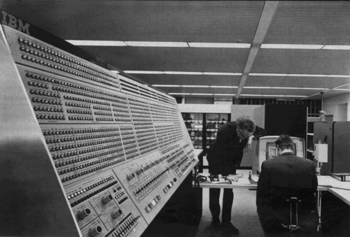
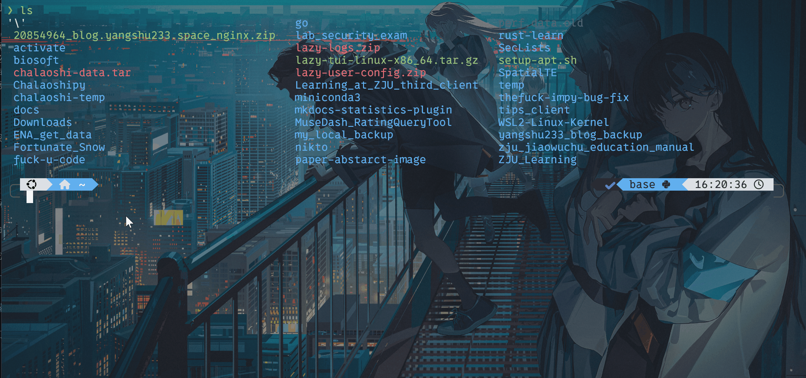
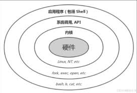

# 终端与命令行——可是我真的不是黑客！

如果你在影视剧里接触过有关于黑客或网络安全高手的形象，那么他们大抵离不开以下几样东西：

黑灯瞎火的房间，超级大的屏幕，神秘兜帽男，和<b>正在疯狂跳动着字符的黑不溜秋的窗口</b>。

当然，本章节的重点与前三样无关，接下来请允许我与文档带着你一起揭开这个黑不溜秋的窗口的神秘面纱，学会一种有别于你日常与电脑的交互方式——**命令行**。

## 往日拾遗——终端从何而来，我们为什么需要终端

在计算机发展的早期，还都只是些轰隆作响的傻大个，没有键盘，没有鼠标，更没有屏幕，唯一一个和计算机的交互方式就是用一卷长得像卫生间里用到卷纸，在上面按照特定的排列顺序打出孔洞，然后把这卷纸送进计算机的识别设备里。人打出来的特定孔洞被转化为了机器码被计算机执行，之后这个傻大个会将输出结果用打印的方式（没错，就像你家里的打印机）印刷在纸上从机器里喷出来。

!!! note
    早期计算机使用的打印机输出速度之快，甚至能让输出纸带飞起来，当计算机输出结果时候，工程师往往需要手脚协调，一边用手拉出纸带，一边用脚在地板上的纸堆里翻找，最终找到关键的片段将其撕下，标注后钉在墙上。

其中，**用来读取输入和输出结果**的（也就是读取打孔纸带的和打印输出纸带的）共同组成了最原始的<b>终端</b>，所以终端从一开始的定位就是<b>计算机系统中用于输入数据和显示输出结果的交互设备或程序</b>。

!!! note "消除歧义"
    在很多情景下，我们往往会提到“个人终端”、“终端设备”等词汇，他们往往与手机、个人电脑等设备联系在一起，或许与终端有相似之处，但是它们不等同于这里提到的终端~

随着时代发展，人们发现用打孔的方式来输入信息，和以打印的方式来输出信息似乎有点不太优雅（还很浪费纸），于是<b>电传打字机</b>的出现极大改变了人们与计算机的交互逻辑，简单来说，我们有键盘可以用了。（如果你好奇电传打字机是怎么工作的，可以自行搜索一下）。

同时，屏幕的发展使得我们可以淘汰掉打印输出这步骤（或许你已经意识到常见的`print`函数原意是啥了），直接将结果显示在屏幕上。到这步，原先物理意义上的终端被电子化的设备取代，但终端的概念被继承了下来，它们从硬件层面转移到了软件层面，出现了<b>软件模拟终端</b>，本质上是用软件来复刻当年老辈子们用的玩意，但是基本精神不变——<b>接受用户输入并显示输出结果</b>。

!!! note "TTY与伪终端"
    说实话，TTY与伪终端是终端发展史里很重要的两个东西，但是受限于篇幅和难度考虑，我这里将其简略，感兴趣的可以自行搜索一下它们到底是什么。

!!! tip "认识认识你电脑上的终端"
    现代操作系统通常都带有自己的终端软件，比如Windows 11 推出了 Windows Terminal，MacOS 与 Linux 作为类Unix系统自带有 Terminal。

    对于Windows 11用户来说，<kbd>Win</kbd> + <kbd>R</kbd>打开`运行`窗口，输入`WT`后回车，就可以打开Windows 11自带的终端软件了，默认Shell为Powershell。

    对于MacOS用户来说，<kdb>Command</kdb> + <kdb>Space</kdb>打开“聚焦搜索”，输入`Terminal`后即可看到终端程序，单击即可打开。

    Linux用户……真的要我教吗？

## 真的不是因为装逼才用的命令行！

我们现在已经习惯了图形用户界面 (GUI)的存在，日常使用电脑，我们都在与各个“窗口”交互，这种直观易懂的交互方式很大程度上推动了计算机飞入寻常百姓家。

但是在早期不存在图形化界面的时候，人们是如何操作计算机的呢？答案是通过纯键盘纯字符的方式——<b>命令行界面</b>，俗称命令行，就是你在上一步打开终端时候看到的界面。

不过应当说，现代操作系统终端所提供的命令行不再是传统意义上的命令行了，不过这无伤大雅，基本的操作逻辑还是一样的，你可以只通过键盘与计算机交互，执行一些程序和命令，操作你的文件。

### 动手时间！来和我一起体验一下命令行！

如果你不知道命令行该如何操作，现在请你打开你的终端，和我一起简单体验一下如何只用键盘来与计算机交流。我们将实践几个简单的关于文件和目录的命令~

!!! note 
    每个人看到的终端界面可能都有所不同，你也可能会疑惑我的终端界面为什么看起来这么不一样，不用着急，这不是你的问题，因为我在使用终端的时间里做了很多配置，使得它看起来更美观。当你熟悉终端与命令行操作时候，你也一定有能力自己配置出好看的终端的~

#### ls、pwd 与 cd

先让我们在终端里运行一下`ls`：

!!! tip
    保证输入法为英文输入法，输入`ls`，并按下回车。

这个命令可以列举出当前工作目录下的所有非隐藏文件。

当然它也可以查看隐藏文件，我们只需启用选项`-a`：

有关于**选项**这个词，稍后会有解释~

除了查看当前目录下的文件，你还可以通过`cd`来切换当前的工作目录：

!!! tip "参数与选项"
    在刚刚的`cd`命令中，我们传入了一个参数（这里是一个目录），而在`ls -a`中，我们称`-a`为选项，它们是命令行中极为重要的概念，就像你吃饭时候离不开筷子和汤匙。

    如果命令本身（比如`ls`）是一个动词，那么参数就是命令作用的宾语，选项就是修饰动词的副词，用以改变命令的行为。

    在类Unix系统中，参数一般直接以值的形式出现，正如我们刚刚`cd`命令中传入的目录名字。

    而选项则一般以`-`加一单字母或`--`加一单词的形式出现，它可以是不带传入值的，也可以是带有可选传入值或者必选传入值的。

    哦你可能觉得这个很绕，没关系，多用用就理解了！让我们继续。

有意思的是，你可以通过`cd -`来返回上一次所在的目录~

如果你觉得你迷路了，没关系！`pwd`命令会告诉你当前所处的工作目录是什么：

好玩吧？这三个命令等价于你在资源管理器或者访达里“打开目录”-“切换目录”-“查看路径”的操作，命令行界面以简洁的字符形式帮你完成了以上工作，虽然他们没有图形界面那么直观，但是它足够高效。

#### 更多

或许简单的三个命令行命令不能满足你的好奇心，并且这三个命令只能让你窥见命令行世界的一角，不足以体现它的全部魅力，这里我非常推荐你去学习一下Linux基本的命令入门，你不必现在就进入到Linux的世界，但是学习如何在命令行世界里生存对你之后的项目有莫大的帮助！

[Linux Journey](https://labex.io/linuxjourney)，我推荐前两章节<b>Getting Started</b>与<b>Command Line</b>。

### 藏在终端背后的神秘人物——Shell

当我们向终端输入命令并回车执行的时候，你有没有想过，到底是谁在执行我们的命令？你可能会说，操作系统/电脑，这对了一半，我们所做的绝大部分事情都需要操作系统帮助我们协调资源，调用硬件，但是出于安全考虑，操作系统不允许你直接调用操作系统的核心组件，避免将电脑搞坏了。

而Shell成为了用户与操作系统沟通的桥梁，它就像壳子一样套在操作系统外周，提供了一个可输入可操作的界面，将用户的命令转化为特定的执行指令，代替你调用各种程序与接口。

而终端则是最先接触到输入与最后接收输出的地方，注意区别。

## 最后

为什么要单开一张讲终端和命令行呢？因为之后你的许多操作都需要在终端中通过命令行执行，我希望在这里就为你揭开它们的神秘面纱，不要被这黑漆漆的窗口吓倒，我敢保证它们是非常优雅的作品，你一定会喜欢上它们的！